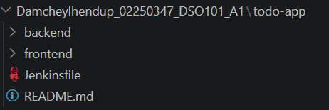
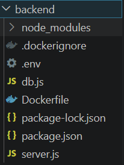

https://github.com/Damcheylhendup/DSO101.git

# DSO101 Continuous Integration and Continuous Deployment Report

## My Information

- Name: Damchey Lhendup
- Student ID: 02250347
- Module: DSO101
- Project: Full-Stack To-Do List Application
- Tools Used: React, Node.js, Express.js, PostgreSQL, Docker, Docker Hub, Jenkins, GitHub Actions, Render

---

# Project Overview

This project is a full-stack To-Do List application developed and deployed using DevOps practices. The application contains a frontend, backend, and database. The project was completed through four assignments: application development, Docker deployment, Jenkins pipeline, and GitHub Actions CI/CD automation.

The main goal of this project was to understand how modern DevOps tools are used to build, test, containerize, deploy, and automate a web application.

---

# Assignment A1: To-Do List Application Development and Deployment

## Objective

The objective of Assignment A1 was to create a simple To-Do List application with frontend, backend, database, environment variables, Docker images, and Render deployment.

---

## Technologies Used

- React.js for frontend
- Node.js and Express.js for backend
- PostgreSQL for database
- Docker for containerization
- Docker Hub for storing images
- Render for deployment
- GitHub for source code hosting

---
# Procedures

## Step 1: Created Project Structure

The project was organized into frontend and backend folders.

todo-app
|-- backend
|-- frontend
|-- README.md

---

## Step 2: Developed Backend

The backend was created using Node.js ad Express.js.

The backend contains API routes for:

  - getting all tasks
  - Adding a new task
  - updating a task
  - deleting a task

The backend port runs on port:
  = port 5000

---

## Step 3: Created PostgreSQL Database

PostgreSQL was used to store To-Do tasks

A tasks table was created automatically using backend code.

The table contains:
  - id
  - title

---

## Step 4: Created Frontend

The frontend was created using React.

The frontend allows users to:
  - Add task 
  - View task
  - Edit task
  - Delete task

The frontend communicates with backend using API requests.

---

## Step 5: Used Environment Variables

Environment variables were used to store important configuration values.

Backend .env included;
  - PORT=5000
  - DATABASE_URL=postgresql://....

Frontend .env included:
  - VITE_API_URL=https://be-todo-02250347.onrender.com

---

## Step 6: Dockerized Backend and Frontend

Dockerfiles were created for both backend and frontend.

Backend Docker image:
  -damchey123/be-todo:02250347

Frontend Docker image:
  -damchey123/fe-todo:02250347

---

## Step 7: Pushed Images to Docker Hub

Docker images were built and pushed to Docker Hub using:
 -Backend:
    -docker build -t damchey123/be-todo:02250347 .
    -docker push damchey123/be-todo:02250347.
 
 -Frontend:
    -docker build -t damchey123/fe-todo:02250347 .
    -docker push damchey123/fe-todo:02250347.

---

## Step 8: Deployed on Render 

Backend and frontend services were deployed on Render using Docker images.

Backend Render URL:
   - https://be-todo-02250347.onrender.com

Frontend Render URL:
   - https://fe-todo-02250347.onrender.com

## A1 Outcome

The application was successfully deployed online. The frontend and backend were connected properly, and users were able to add, edit, delete, and view tasks.

_________________________________________________________________________________________________________________________________

# Assignment A2: Jenkins CI/CD Pipeline

## Objective

The objective of Assignment A2 was to configure Jenkins pipeline for automating build, test, and Docker image creation for the To-Do application.

## Tools Used
  - Jenkins
  - Node.js
  - npm install
  - Docker
  - Git
  - Github

# Precedures

## Step 1: Installed Jenkins

Jenkins was installed on the local machine and opened using:
   - http://localhost:8080

## Step 2: Installed Required Jenkins Plugins

The following plugins were installed:
    - Pipeline
    - NodeJS
    - Git
    - GitHub
    - Docker Pipeline

## Step 3: Configured NodeJS in Jenkins
NodeJS was configured in:
   - Manage Jenkins → Tools → NodeJS installations

NodeJS version used:
   - NodeJS 20.20.2

## Step 5: Created Jenkinsfile
A Jenkinsfile was created inside the project.

The Jenkins pipeline included these stages:
    - Check tools
    - Install backend dependencies
    - Install frontend dependencies
    - Build frontend
    - Run test stage
    - Build backend Docker image
    - Build frontend Docker image

## Step 6: Ran Jenkins Pipeline
The pipeline was executed from Jenkins using:
   - Build Now

The pipeline successfully completed with:
   - Finished: SUCCESS

## A2 Outcome

Jenkins successfully automated dependency installation, frontend build, testing stage, and Docker image build process.

___________________________________________________________________________________________________________________________

# Assignment 3: GitHub Actions CI/CD Pipeline

## Objective

The objective of Assignment A3 was to configure GitHub Actions to automatically build Docker images, push them to Docker Hub, and deploy the application on Render.

## Tools Used:
   - GitHub
   - GitHub Actions
   - Docker
   - Docker Hub
   - Render
   - Node.js
   - npm

# Procedures

## Step 1: Created GitHub Actions Workflow Folder

The workflow folder was created at repository root:
    * .github
         |--workflows
              |--deploy.yml

## Step 2: Created deploy.yml
The deploy.yml file was created to automate CI/CD.

The workflow runs when code is pushed to the main branch.
    on:
      push:
        branches:
            - main

## Step 3: Added Docker Hub Secrets

GitHub repository secrets were added:
   - DOCKERHUB_USERNAME
   - DOCKERHUB_TOKEN

## Step 4: Added Render Deploy Hook Secrets

Render deploy hook secrets were added:
  - RENDER_BACKEND_DEPLOY_HOOK
  - RENDER_FRONTEND_HOOK

These hooks allow GitHub Actions to trigger Render deployment automatically.

## Step 5: Built and Pushed Backend Image

GitHub Actions builds the backend Docker image and pushes it to Docker Hub.
Backend image:
 - damchey123/be-todo:02250347

## Step 6: Built and Pushed Frontend Image

GitHub Actions builds the frontend Docker image and pushes it to Docker Hub.
Frontend image:
  - damchey123/fe-todo:02250347

## Step 7: Triggered Render Deployment

After pushing images to Docker Hub, GitHub Actions triggered Render deployment using deploy hooks.

## Step 8: Verified GitHub Actions Workflow

The workflow was checked in:
  - GitHub Repository → Actions

The workflow completed successfully with green check marks.

## A3 Outcome

GitHub Actions successfully automated Docker image build, Docker Hub push, and Render deployment.

___________________________________________________________________________________

## Challenges Faced

During the project, several issues were faced:

  - Docker Hub push errors
  - Render database connection errors
  - PostgreSQL SSL configuration issue
  - GitHub Actions workflow path issue
  - Docker build path errors
  - Jenkins plugin installation problems
  - Wrong GitHub secret configuration
  - Frontend and backend connection problems

These issues were solved by checking logs, fixing environment variables, correcting file paths, updating Dockerfiles, and configuring GitHub secrets properly.

## Learning Outcomes

Through this project, I learned:

  - How to build a full-stack web application
  - How frontend and backend communicate using APIs
  - How to use PostgreSQL database
  - How to use Docker and Docker Hub
  - How to deploy applications on Render
  - How to create Jenkins CI/CD pipelines
  - How to create GitHub Actions workflows
  - How to use secrets securely
  - How to monitor deployments 
  - How DevOps improves software delivery

## Conclusion

This project successfully demonstrated the complete DevOps workflow for a full-stack To-Do List application. The application was developed, containerized, deployed, automated, and monitored using modern DevOps tools. Assignments A1 to A4 helped me understand the full process of Continuous Integration and Continuous Deployment using Docker, Jenkins, GitHub Actions, Docker Hub, and Render.

## References
Docker Documentation – https://docs.docker.com/
GitHub Actions Documentation – https://docs.github.com/actions
Render Documentation – https://render.com/docs
Jenkins Documentation – https://www.jenkins.io/doc/
Node.js Documentation – https://nodejs.org/
React Documentation – https://react.dev/
Express.js Documentation – https://expressjs.com/